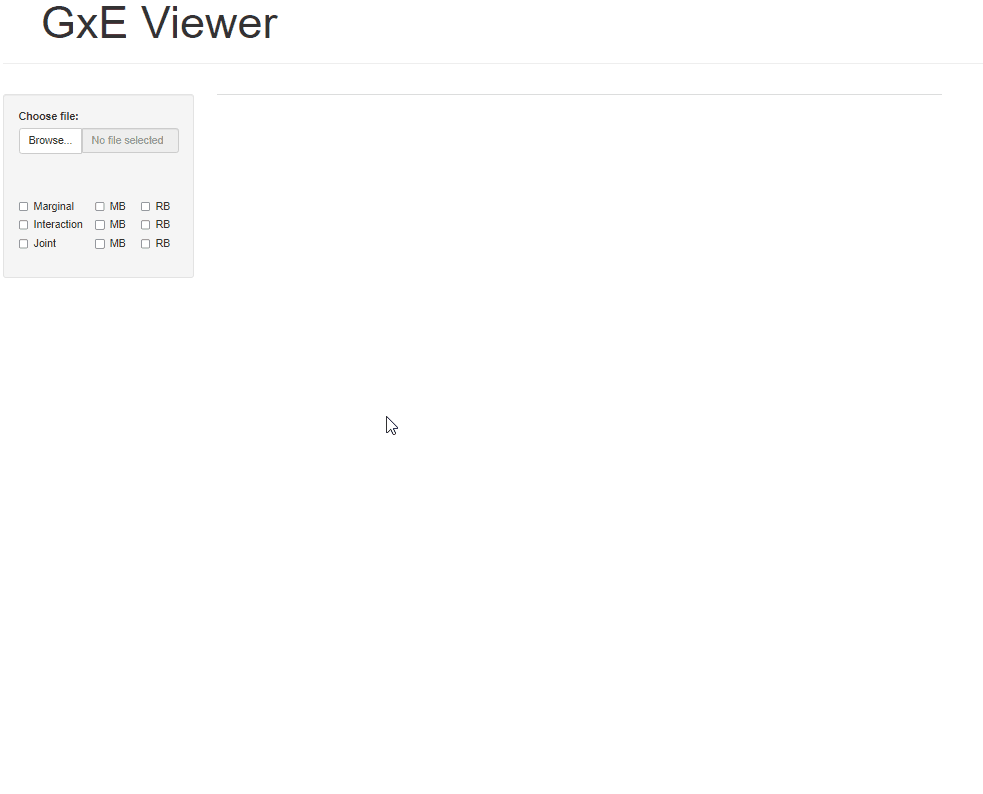

# GxE - Viewer  

GxE-Viewer is an R shiny application that allows users to interact with results from gene-environment interaction software programs, [GEM](https://github.com/large-scale-gxe-methods/GEM) (>= 1.4.1) and [REGEM](https://github.com/large-scale-gxe-methods/REGEM) (>= 1.0.0).

   

## Requirements  

- R (>= 3.5.0)  
- DT (>= 0.18)  
- shiny (>= 1.6.0)  
- ggplot2 (>= 3.3.6)   
- data.table (>= 1.14.0)  

   

## Deploy  
Deploy GxE-Viewer within [Rstudio](https://posit.co/) or on [shiny.app.io](https://duytpm18.shinyapps.io/gxe-viewer/).

   

## Current Features  

- Manhattan plots  
- Summary statistics tables
- Web link to SNP database, [dbSNP](https://www.ncbi.nlm.nih.gov/snp/)  

 

## Input data  

GxE - Viewer requires a result file from a gene-environment interaction study run from [GEM](https://github.com/large-scale-gxe-methods/GEM) (>= 1.4.1) or [REGEM](https://github.com/large-scale-gxe-methods/REGEM) (>= 1.0.0) with --meta-option set to "meta" or "full".  

 

## Example  

